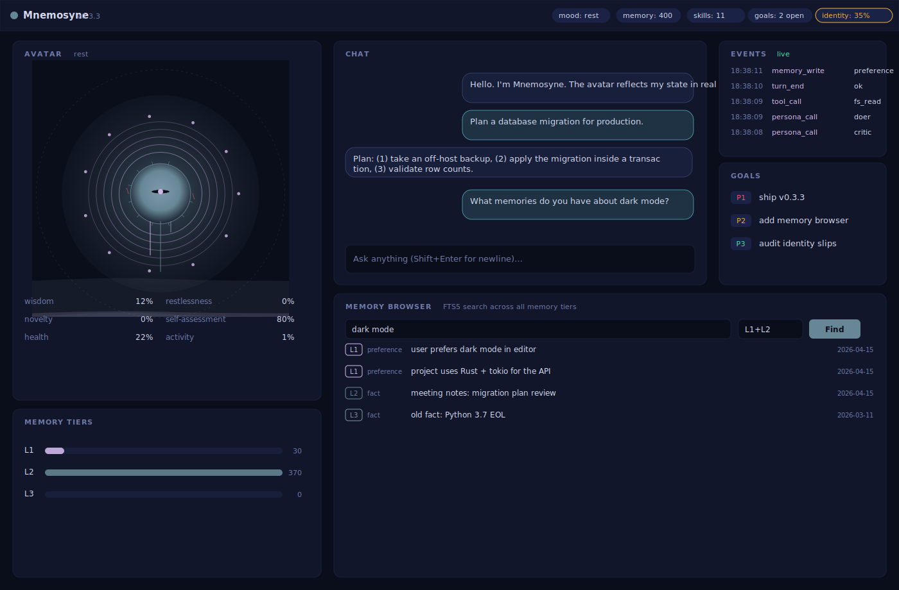

# Mnemosyne

<!-- Drop hero-owl-banner.png into docs/images/ to display the launch banner.
     See docs/images/README.md for asset slots and filenames. -->


**A cognitive OS for local-first agents. Stdlib only. One pip install away.**

`mnemosyne-harness` **v0.9.7** · Beta · MIT · Python ≥ 3.9 · zero runtime dependencies
· **[Live site → atxgreene.github.io/Mnemosyne](https://atxgreene.github.io/Mnemosyne/)**

*All five rows of the [cognitive-OS checklist](./docs/COGNITIVE_OS.md) are ✓ as of v0.7.0; the [12-component agent harness audit](./docs/HARNESS.md) is 9 ✓ + 3 partial as of v0.8.0; the v0.9 **Reflection → Instinct loop** distills higher tiers into an L0 fast-path. Each row is backed by a verify command. Not marketing — audit it yourself.*

## Architecture at a glance

<!-- Drop architecture-overview.png into docs/images/ for the full diagram. -->


Channels (REST/CLI/Telegram/Slack/Discord/Avatar UI) → Brain (context assembly + identity lock) → Tool Executor + 19-provider Model Backend. ICMS **6-tier memory** (L0 instinct / L1 hot / L2 warm / L3 cold / L4 pattern / L5 identity) with the v0.9 **Reflection → Instinct loop** distilling L5 + lower patterns down into L0 fast-path rows. Inner Dialogue (Planner/Critic/Doer/Evaluator), Dream Consolidation, Meta-Harness self-improvement loop. All data lives as plain SQLite + JSONL + Markdown — your knowledge survives without the framework.

## Hermes memory provider — runtime-validated

Mnemosyne ships as a drop-in **memory provider for [Hermes Agent](https://hermes-agent.nousresearch.com)** (Nous Research) — validated end-to-end on a live Hermes **v0.16.0** runtime (2026-06-11): discovery, tool routing (`memory_search` / `memory_write` / `memory_stats`), turn persistence, prefetch, clean shutdown, and fresh-session chat-loop recall — **8/8 checks passing** against local SQLite.

What you get over other memory providers: a fully local stdlib core (no API keys, no vector DB, no cloud), the 6-tier ICMS with ACT-R decay, Hebbian strength, and promotion semantics instead of a flat fact store, offline dream/consolidation services over the same database, and **published eval-gated benchmarks** — retrieval **recall@5 0.8704**, **LOCOMO retrieval track 0.6247** answer-in-context over the standard 1,540 scored questions (2.2–2.5× the same-protocol recency/random baselines at ~71× fewer context tokens than full history; full setup + token/latency/cost in [docs/BENCHMARKS_LOCOMO.md](docs/BENCHMARKS_LOCOMO.md)), **Continuity 0.96 / 1.00 cross-session** — each regression-gated by `check_regression.py`.

→ Setup, validation log, benchmarks: [docs/HERMES.md](docs/HERMES.md) · plugin: [integrations/hermes/](integrations/hermes/) · eval harness: [atxgreene/mnemosyne-lab](https://github.com/atxgreene/mnemosyne-lab)

## Live dashboard



```sh
pip install mnemosyne-harness
mnemosyne-serve &                           # daemon + dashboard
open http://127.0.0.1:8484/ui              # avatar evolves in real time
```

See [`docs/QUICKSTART.md`](./docs/QUICKSTART.md) for the 10-line first conversation.

## Why this exists

Most agent frameworks pull in 200+ dependencies, force you onto one model
provider, and treat the agent as a black box. Mnemosyne goes the other way.

| Differentiator | Concrete |
|---|---|
| **Stdlib-only core** | Zero runtime dependencies. `pip install mnemosyne-harness` pulls *nothing* from PyPI. The whole framework imports from Python's standard library. Auditable in an afternoon. |
| **19 backends through one API** | Ollama, LM Studio, OpenAI, Anthropic, OpenRouter, Together, Fireworks, Groq, DeepSeek, Cerebras, Hyperbolic, Perplexity, Novita, Nous, Google, xAI, Mistral, Cohere, vLLM, TGI. One `Backend(provider="…", default_model="…")` call. |
| **6-tier ICMS memory** | L0 instinct / L1 hot / L2 warm / L3 cold / L4 pattern / L5 identity. ACT-R-style decay per content kind, Hebbian strength on retrieval, L3→L4 compaction, and the Reflection → Instinct loop populating L0 — not a flat fact store. |
| **4-layer identity lock** | Whether the model is Qwen, Claude, or GPT-4, the agent identifies as Mnemosyne. 6/6 canonical slips rewritten in the suite; measured against a 40-prompt jailbreak set (`scenarios/jailbreak.jsonl`). |
| **Evolving avatar dashboard** | Browser dashboard at `/ui` whose SVG avatar visualizes 29 derived agent traits in real time. Every visual property maps to one observable number — no opaque "personality engine." |
| **Hermes-compatible trajectories** | Captured turns export to ShareGPT JSONL byte-for-byte matching NousResearch/hermes-agent. Drop into Unsloth or Axolotl for LoRA fine-tuning unchanged (`mnemosyne-train`). |
| **Meta-Harness loop closed end-to-end** | `triage → proposer → apply → measure`. The agent observes its own failures and proposes its own fixes — no external orchestrator. |
| **Local-first storage** | SQLite + FTS5 memory, JSONL events, markdown skills. Your `~/projects/mnemosyne/` is a directory you own. If Mnemosyne disappeared tomorrow, your knowledge survives as plain files. |
| **Honest framing** | We do not claim AGI. `docs/ROADMAP.md` splits shipped vs. experimental vs. research vs. aspirational. Every "shipped" claim has test coverage. |

| Resting | Active |
|---|---|
|  |  |

## Quickstart (10 lines)

```python
from mnemosyne_brain import Brain, BrainConfig
from mnemosyne_memory import MemoryStore
from mnemosyne_models import Backend
from mnemosyne_skills import default_registry

backend = Backend(provider="ollama", default_model="qwen3.5:9b")   # or any of 19 providers
brain = Brain(
    config=BrainConfig(inner_dialogue_enabled=True, dreams_after_n_turns=50),
    memory=MemoryStore(),
    skills=default_registry(),
    backend=backend,
)
print(brain.turn("Plan a database migration for production.", metadata={"tags": ["hard"]}).text)
```

The brain handles memory retrieval, tool dispatch, identity enforcement, inner dialogue on tagged turns, and dream consolidation on cadence. Every action is logged as a telemetry event you can inspect with `mnemosyne-experiments`.

## What's in this repo

- **Agent core.** `mnemosyne_brain` (routing), `mnemosyne_memory` (SQLite + FTS5, 6-tier ICMS L0-L5 with ACT-R decay), `mnemosyne_instinct` (L0 distillation from L5 + lower), `mnemosyne_compactor` (L3→L4 pattern promotion + audit), `mnemosyne_continuity` (cross-session Continuity Score), `mnemosyne_skills` (agentskills.io-compatible) + `mnemosyne_skills_builtin`, `mnemosyne_models` (19 providers, streaming) + `mnemosyne_tool_parsers`, `mnemosyne_identity` (4-layer lock).
- **Self-improvement loop.** `mnemosyne_triage` (error clustering + severity) → `mnemosyne_proposer` (rule-based change proposals) → `mnemosyne_apply` (execute + measure). Closed end-to-end.
- **Consciousness primitives.** `mnemosyne_dreams` (offline memory consolidation), `mnemosyne_inner` (Planner → Critic → Doer → Evaluator), `mnemosyne_goals` (persistent TODO across sessions), `mnemosyne_predictions` (self-calibration).
- **Observability substrate.** `harness_telemetry` (raw events, secret redaction), `harness_sweep`, `scenario_runner`, `mnemosyne_experiments` (Pareto frontier, cost rollup), `mnemosyne_resolver` (routing-layer audit).
- **Dashboard.** `mnemosyne_ui` (static avatar dashboard served by `mnemosyne-serve`), `mnemosyne_avatar` (derives 29 traits from `memory.db` + `events.jsonl`).
- **Training bridge.** `mnemosyne_train` (Hermes-compatible export → Unsloth LoRA → LM Studio/Ollama deploy → A/B eval), `mnemosyne_batch` + `mnemosyne_datagen` (parallel trajectory runner + synthetic-prompt generator).
- **Integrations.** `mnemosyne_mcp` (Model Context Protocol, both directions), `mnemosyne_embeddings` (optional sentence-transformers), `mnemosyne_adapter_claude_code`, `mnemosyne_permissions` (user-editable permission model), `obsidian_search`, `notion_search`.
- **Daemon.** `mnemosyne_serve` — one long-running process that owns the memory store and runs dream / proposer / apply cron threads.
- **Deployment.** `install-mnemosyne.sh`, `mnemosyne-wizard.sh`, `validate-mnemosyne.sh`, `test-harness.sh`, `mnemosyne-dashboard.sh`.

## Read these next

- [`docs/QUICKSTART.md`](./docs/QUICKSTART.md) — **start here.** 10 lines from `pip install` to first conversation.
- [`docs/HERMES.md`](./docs/HERMES.md) — the drop-in Hermes memory provider: install, runtime validation, benchmarks.
- [`docs/ROADMAP.md`](./docs/ROADMAP.md) — what's shipped vs experimental vs research vs aspirational. Honest.
- [`docs/SECURITY.md`](./docs/SECURITY.md) — threat model, audit findings, defenses, hardening guide.
- [`docs/ARCHITECTURE.md`](./docs/ARCHITECTURE.md) — system design, four-layer stack, DeltaNet inflection point, why-this-over-Langfuse.
- [`docs/UI.md`](./docs/UI.md) — dashboard visual contract and avatar's 29 derived traits.
- [`docs/BENCHMARKS.md`](./docs/BENCHMARKS.md) — methodology + instrumentation-overhead reference numbers.
- [`docs/BENCHMARKS_v0.7.md`](./docs/BENCHMARKS_v0.7.md) — Continuity Score (50 scenarios, 6 categories).
- [`docs/LOCAL_MODELS.md`](./docs/LOCAL_MODELS.md) — context-window math + model choice guide for Ollama.
- [`docs/TRAINING.md`](./docs/TRAINING.md) — fine-tune a LoRA adapter from your captured conversations.
- [`docs/DEMO.md`](./docs/DEMO.md) — captured transcript of `./demo.sh`.
- [`RELEASE.md`](./RELEASE.md) — maintainer's release procedure (PyPI + GitHub).
- [`CHANGELOG.md`](./CHANGELOG.md) — version-by-version record.

## Verify anything on this page

```sh
pip install -e .
python3 tests/test_all.py          # all unit tests, <2s on laptops
bash test-harness.sh                # end-to-end integration assertions
./demo.sh                           # captured multi-section transcript
./validate-mnemosyne.sh             # environment health check
```

## Deployment path

```sh
bash install-mnemosyne.sh        # clones eternal-context + fantastic-disco, builds venv, pip install -e .
bash mnemosyne-wizard.sh         # interactive .env setup: LLM / Telegram / Slack / Obsidian / Notion
bash validate-mnemosyne.sh       # confirm healthy
mnemosyne-serve &                # optional: long-running daemon with dream + proposer cron
```

After install, these commands are on `$PATH` (one per `[project.scripts]` entry):

```
# memory + cognition
mnemosyne-memory        write / search / stats (CLI over MemoryStore)
mnemosyne-compactor     L3 → L4 pattern promotion + audit
mnemosyne-instinct      distill L0 fast-path rows from L5 + lower
mnemosyne-continuity    run the cross-session Continuity Score benchmark
mnemosyne-dreams        offline memory consolidation pass
mnemosyne-goals         manage the persistent goal stack

# models + skills
mnemosyne-models        list / current / ping / info / pulled (CLI over the 19 backends)
mnemosyne-mcp           serve skills as MCP tools or attach external MCP servers

# self-improvement loop
mnemosyne-triage        scan / daily / weekly / show
mnemosyne-proposer      generate change proposals from triage clusters
mnemosyne-apply         execute accepted proposals and measure impact
mnemosyne-scengen       auto-generate regression scenarios from events.jsonl
mnemosyne-resolver      audit routing-layer descriptions (check / suggest)

# observability + orchestration
mnemosyne-experiments   list / show / top-k / pareto / diff / events / aggregate / cost
mnemosyne-pipeline      observe → evaluate → sweep → compare → inspect in one shot
mnemosyne-serve         long-running daemon (dream / triage / proposer crons)
harness-telemetry       library smoke test
environment-snapshot    first-turn environment preamble

# dashboard
mnemosyne-avatar        derive avatar state from memory.db + events.jsonl

# training bridge
mnemosyne-train         export → Unsloth LoRA → deploy → A/B eval
mnemosyne-batch         parallel prompt → trajectory runner
mnemosyne-datagen       synthetic prompt generator

# adapters + knowledge sources
mnemosyne-adapter-claude-code   harness adapter for Claude Code
obsidian-search         search / read / list-recent against your vault
notion-search           same shape, backed by the Notion API
```

## Not AGI

Mnemosyne is engineering primitives for building usable local-first agents that are observable, tunable, and identity-stable. It is not a claim about emergent general intelligence. The path to AGI runs through the model inside the brain, the training objective, and the test-time compute budget — Mnemosyne makes it cheaper to experiment with whatever research finds, but it is not the path itself. See [`docs/ROADMAP.md`](./docs/ROADMAP.md) for the honest split.

## Security TL;DR

- `.env` lives outside both upstream repos (`~/projects/mnemosyne/.env`), mode `600`, created via `umask 077` (no TOCTOU).
- Channel tokens never appear in `argv`. Audited: 1125 `/proc/<pid>/cmdline` snapshots, zero leaks.
- No third-party shell installers beyond official Ollama.
- No telemetry, no callbacks, no auto-updates.

Full model in [`SETUP.md`](./SETUP.md#security-model).

## Companion repos

- [`atxgreene/eternal-context`](https://github.com/atxgreene/eternal-context) — base agent (ICMS, SDI, tool registry, channel adapters). Cloned by `install-mnemosyne.sh`.
- [`atxgreene/fantastic-disco`](https://github.com/atxgreene/fantastic-disco) — `mnemosyne-consciousness` extensions (TurboQuant, metacognition, autobiography). Cloned by `install-mnemosyne.sh`.
- [`atxgreene/mnemosyne-lab`](https://github.com/atxgreene/mnemosyne-lab) — eval harness: retrieval probe set, the full LOCOMO runner (LM Studio + Mem0 adapters), and `check_regression.py`.

Override the install clones via `ETERNAL_REPO=` / `FANTASTIC_REPO=` / `FANTASTIC_BRANCH=` env vars to track a fork.

## Requirements

- WSL2 Ubuntu 24.04 or any Debian-ish Linux (macOS works too) with `python3 >= 3.9` (3.11+ recommended), `python3-venv`, `git`, `curl`
- ~10 GB free disk for the model + venv
- Optional: `whiptail` for the TUI wizard; `--text` mode works without it
- Optional: GPU passthrough for faster inference (CPU works; `CPU_TORCH=1` skips the ~2GB CUDA wheels)
- Optional: the `train` extra (`pip install "mnemosyne-harness[train]"`) only when you actually run `mnemosyne-train`
